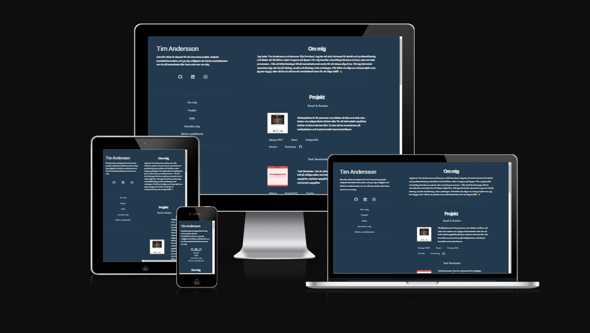
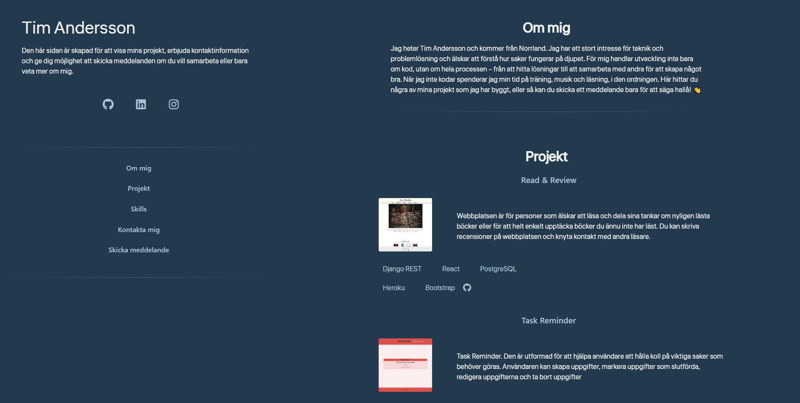
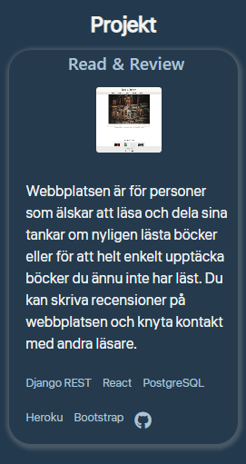
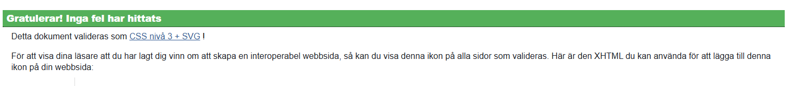
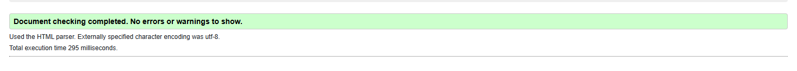
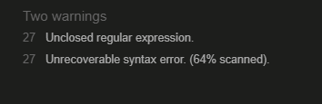
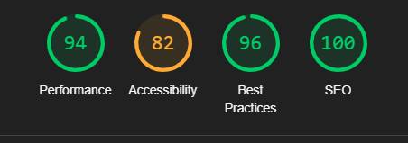

# Personal Webpage V1


## Description
This is a personal website built with **React** and **Django REST** as API email. The website showcases my projects and includes a contact feature where users can send messages via email.

### Responsive Design



The image above showcases the responsive design of my personal website. It demonstrates how the site adapts seamlessly to different screen sizes, ensuring a consistent user experience across devices.

## Table of Contents
- [Description](#description)
    - [Responsive Design](#responsive-design)
    - [Front View](#front-view)
        - [Mobile View](#mobile-view)
        - [Desktop View](#desktop-view)
    - [Contact Feature Overview](#contact-feature-overview)
        - [Mobile View](#mobile-view-1)
        - [Desktop View](#desktop-view-1)
    - [Project Section](#project-section)
        - [Desktop View](#desktop-view-2)
        - [Mobile View](#mobile-view-2)
    - [Contact Section](#contact-section)
        - [Desktop View](#desktop-view-3)
        - [Mobile View](#mobile-view-3)
    - [Teknik Section](#teknik-section)
        - [Desktop View](#desktop-view-4)
        - [Mobile View](#mobile-view-4)
    - [Footer Section](#footer-section)
        - [Desktop View](#desktop-view-5)
        - [Mobile View](#mobile-view-5)
- [Technical Stack](#technical-stack)
    - [Install Dependencies](#install-dependencies)
- [Deployment](#deployment)
    - [Deployment to Heroku](#deployment-to-heroku)
    - [Deploying to GitHub](#deploying-to-github)
- [Improvements](#improvements)
- [Installed Libraries](#installed-libraries)
- [Problems with Deployment](#problems-with-deployment)
- [Bugs](#bugs)
- [Testing in React](#testing-in-react)
    - [CSS Jigsaw Validation](#css-jigsaw-validation)
    - [W3C Validator](#w3c-validator)
    - [JSHint Validation](#jshint-validation)
- [Lighthouse Test](#lighthouse-test)
- [Credit](#credit)


### Front View

#### Mobile View

* The image above shows the initial mobile view of the website. Users are greeted with a clean and intuitive interface, ensuring easy navigation.

#### Desktop View

* The image above shows the initial desktop view of the website. The navigation bar at the top allows users to easily access different sections of the site, including projects, contact, and more.

This section provides an overview of the initial view of the website when users first visit. The navigation bar ensures that users can easily find and access all parts of the site.

### Contact Feature Overview

#### Mobile View

* The image above shows the mobile view of the contact feature. Users can send messages by providing their name, email, and a description. All fields are required to send a message.

#### Desktop View

* The image above shows the desktop view of the contact feature. Similar to the mobile view, users must provide their name, email, and a description to send a message.


### Project Section

#### Desktop View

* The image above shows the desktop view of the project section. Here, you can find information about the project and the frameworks used, such as Django REST and React. The GitHub repository is also linked for easy access.

#### Mobile View

* The image above shows the mobile view of the project section. The layout is optimized for smaller screens, ensuring that all information is easily accessible and readable.


### Contact Section

#### Desktop View

* The image above shows the desktop view of the contact section. This part includes my contact information such as my email address, name, and location.

#### Mobile View

* The image above shows the mobile view of the contact section. The layout is optimized for smaller screens, ensuring that all contact information is easily accessible and readable.


### Teknik Section

#### Desktop View

* The image above shows the desktop view of the teknik section. This section highlights my skills and the technologies I am proficient in, such as Django REST, React, and PostgreSQL.

#### Mobile View

* The image above shows the mobile view of the teknik section. The layout is optimized for smaller screens, ensuring that all information about my skills and technologies is easily accessible and readable.


### Footer Section

The footer of my personal website includes my name and copyright information. It is built using **Django REST** and **React**.

#### Desktop View

* The image above shows the desktop view of the footer. It includes my name and copyright information, ensuring that visitors know who created the website.

#### Mobile View

* The image above shows the mobile view of the footer. The layout is optimized for smaller screens, ensuring that all information is easily accessible and readable.


## Technical Stack
- **Frontend**: React, React Router, Axios, Bootstrap
- **Deployment**: Frontend on Heroku

### Install Dependencies
#### Frontend:
```bash
cd frontend
npm install
npm start
```

## Deployment 
The frontend is deployed on **Heroku**.

- **Frontend**: [Link to live website](https://my-webpage-v1-react-c9cd915b1668.herokuapp.com)

## Deployment to Heroku

### Preparations
1. Create an account on [Heroku](https://www.heroku.com/).
2. Install [Heroku CLI](https://devcenter.heroku.com/articles/heroku-cli).

### Create a Heroku app manually
1. Log in to your Heroku account.
2. Click on "New" and select "Create new app".
3. Name your app `my-webpage-v1-react` and click "Create app".

### Deploy the code manually
1. Navigate to the "Deploy" tab in your Heroku app dashboard.
2. Connect your GitHub repository.
3. Select the branch you want to deploy and click "Deploy Branch".

## Deploying to GitHub

### Create a GitHub Repository
1. Go to [GitHub](https://github.com/) and log in to your account.
2. Click on the "+" icon in the top right corner and select "New repository".
3. Name your repository `my-webpage-v1-react` and click "Create repository".

### Push Code to GitHub
1. Open your project in VSCode.
2. Open a terminal in VSCode.
3. Initialize a new Git repository:

4. Add your files to the repository:
        ```bash
        git add .
        ```
5. Commit your changes:
        ```bash
        git commit -m "Initial commit"
        ```
7. Push your code to GitHub:
        ```bash
        git push 
        ```


## Improvements
- Add more information
- Add a blog section

## Installed Libraries

The following libraries are used in this project:

### Dependencies

```json
{
    "@testing-library/jest-dom": "^6.6.3",
    "@testing-library/react": "^16.2.0",
    "@testing-library/user-event": "^13.5.0",
    "axios": "^1.7.7",
    "bootstrap": "^5.3.3",
    "jwt-decode": "^3.1.2",
    "react": "^18.3.1",
    "react-bootstrap": "^2.10.5",
    "react-dom": "^18.3.1",
    "react-router-dom": "^6.28.0",
    "react-scripts": "5.0.1",
    "typescript": "^4.9.5",
    "util": "^0.12.5",
    "web-vitals": "^2.1.4"
}
```
``` json
  "devDependencies": {
    "@testing-library/dom": "^10.4.0",
    "@types/react": "^19.0.1",
    "@types/react-dom": "^19.0.1",
    "jest": "^29.7.0",
    "msw": "^2.6.8",
    "nsw": "^0.1.0"
  },
  "jest": {
    "transformIgnorePatterns": [
      "/node_modules/(?!axios)/"
    ]
  }
  ```
## Problems with Deployment
I encountered issues with the deployment and had to create a new repository in GitHub. I moved my frontend code to the new repository while keeping the backend in the original repository.
## Bugs

### Known Issues
There are currently no known issues.

### Resolved Issues
There are no resolved issues at this time.
## Testing in React 

## Testing in React

### Contact Page Tests

The following tests have been conducted in the `sendingemail.test.js` file for the contact page:

| Test Description | Status |
|------------------|--------|
| Displays submit button in the contact form to ensure users can send messages | ✔️ |
| Text showing after a message is sent to confirm successful submission | ✔️ |

## Testing valditations 

### CSS Jigsaw Validation
Here is a screenshot of the CSS validation test using the Jigsaw validator:



### W3C Validator

The HTML of the website has been validated using the W3C Validator, ensuring that the code adheres to web standards and best practices.



### W3C Validator
The HTML of the website has been validated using the W3C Validator, ensuring that the code adheres to web standards and best practices.


### JSHint Validation
The JavaScript code has been checked using JSHint. There were 2 warnings, but no serious issues were found.




## Lighthouse Test


Here are all the Lighthouse results in Chrome.

## Credit
I have taken help from the following resources:

- [Google Fonts](https://fonts.google.com/selection)
- [CSS Scroll Behavior](https://www.w3schools.com/cssref/pr_scroll-behavior.php)
- [Font Awesome Python Icons](https://fontawesome.com/search?q=python&o=r&ic=free)
- [Intersection Observer API with ReactJS](https://blog.sachinchaurasiya.dev/simple-guide-to-using-intersection-observer-api-with-reactjs?utm_source=chatgpt.com)
- [Waving Hand Emoji](https://emojipedia.org/waving-hand)
- [Emoji Favicons](https://favicon.io/emoji-favicons/#google_vignette)
